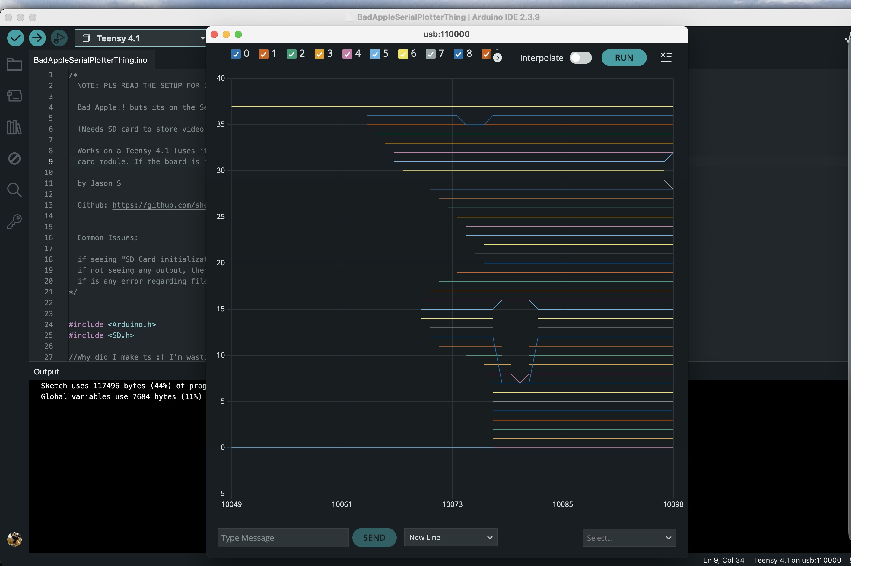

# Bad Apple!! on the Arduino Serial Plotter



This plays the [Bad Apple!!](https://www.youtube.com/watch?v=FtutLA63Cp8) shadow-art video inside the Arduino IDE's Serial Plotter, a tool built for graphing sensor readings, not video. The trick is to treat each plotted line as a brush stroke and draw the silhouette one frame at a time on a 50×37 grid.

A Python script turns an `.mp4` into a small custom `.plot` file, and a Teensy 4.1 reads that file off an SD card and streams it to the plotter frame by frame.

**Read the setup section before you run it, or it won't work.**

## How it works

The Serial Plotter keeps the last 50 samples on screen and draws straight lines between consecutive points. That's the whole basis for the hack:

- Each frame prints 50 columns (the 50 visible samples) of 37 line series (the vertical resolution), giving a 50×37 grid.
- A video frame is downscaled to 50×37, turned grayscale, and thresholded to black and white.
- For each horizontal run of pixels in a row, `encode_frame` picks the best height to park that line. Since the plotter connects every point, you can't avoid stray segments (a horizontal line where it parks, vertical "risers" where it jumps heights); the encoder chooses the height that overlaps the silhouette least. Pixels that shouldn't be drawn come out as `NaN`, so the plotter leaves a gap.
- The grid is packed into text, one character per cell (`chr(value + 34)`), frames separated by `~`. The Teensy reads it back and prints it as the `y:value` pairs the plotter expects, with fixed `L:`/`H:` bounds so the axis doesn't rescale.

## Files and format

```
vidtoline_convert.py                            # mp4 -> .plot encoder (Python + OpenCV)
badapple.mp4 / badapple.plot                    # source video / encoded output (50x37, 2785 frames, 12 fps)
BadAppleSerialPlotterThing/...ino               # player sketch (Teensy 4.1 or any SD-card board)
```

The `.plot` file is a header line `<width> <height> <frame_count> <fps>` (e.g. `50 37 2785 12`), then one frame per line: `width*height` chars ending in `~`. Each char decodes to a height with `ord(char) - 34`; anything outside `[0, height)` is a gap.

## Prerequisites

- A microcontroller with SD storage and a microSD card. A [Teensy 4.1](https://www.pjrc.com/store/teensy41.html) is what this was built and tested on (it uses the built-in SD slot, no wiring), but any board with an SPI SD card module works — set `SD_CS_PIN` in the sketch to your module's chip-select pin.
- [Arduino IDE](https://www.arduino.cc/en/software). For a Teensy you also need [Teensyduino](https://www.pjrc.com/teensy/td_download.html); for other boards, install that board's core instead.
- Python 3 with `opencv-python` and `numpy`, only if you want to re-encode your own video

## Setup

**1. (Optional) Encode your own video.** A `badapple.plot` is already included, so skip this unless you want a different clip:

```bash
pip install opencv-python numpy
python vidtoline_convert.py
```

It reads `badapple.mp4` and writes `badapple.plot`. Knobs at the top of the script: `WIDTH` (50; this is the plotter's fixed sample window, leave it alone), `HEIGHT` (37; the number of lines, needs the patch below to go past 8), `FPS` (12), `INVERT` (flips which pixels count as "on"), `THRESHOLD` (black/white cutoff, 0-255), and `INPUT_FILE`/`OUTPUT_FILE`.

**2. Patch the Serial Plotter to allow 37 lines (required, one-time).** By default the plotter only draws 8 lines at once, but Bad Apple needs 37 (one per image row). Without this you'd only see the top 8 rows. The cap is baked into a file in the app, so you edit it by hand. The same edit also makes the 8 colors repeat instead of running off the end and crashing.

> _Note: this edit is only verified on Arduino IDE 2.3.9 on Mac. It most likely works on later IDE versions and on Windows too, but those aren't tested, the file name and exact paths may differ._

- **a. Quit Arduino IDE completely.** If it's open, the file may be locked or your change gets ignored when the plotter loads.
- **b. Open the app's `js` folder.**
  - Windows: in `C:\Program Files\Arduino IDE\`, go to `resources` -> `app` -> `lib` -> `backend` -> `resources` -> `arduino-serial-plotter-webapp` -> `static` -> `js`.
    _(Not tested need verifying)_
  - Mac: in Applications, right-click **Arduino IDE.app** -> **Show Package Contents**, then `Contents` -> `Resources` -> `app` -> `lib` -> `backend` -> `resources` -> `arduino-serial-plotter-webapp` -> `static` -> `js`.
- **c. Find the file** named `main.something.chunk.js`. The "something" is a random-looking code that changes between IDE versions (on my machine it's `main.35ae02cb.chunk.js`). If there's only one `main....chunk.js`, that's it.
- **d. (Windows only) Grant write access.** Right-click the file -> **Properties** -> **Security** tab -> **Edit**, pick your username, check **Allow** for **Write** and **Modify**, then OK. (Mac skips this; your editor asks for your password on save.)
- **e. Open it in any text editor that can search.** No code editor needed — TextEdit on Mac (or Notepad on Windows) is fine. Use Find (Cmd+F / Ctrl+F) and search for `<8` to jump to the spot highlighted below:

  

- **f. Make two changes there.** Change both `8`s in `c.length < 8` to `50` (or any number at or above your video height), and change the two color lines `u[c.length]` to `u[c.length % 8]` so the 8 colors repeat instead of running off the end. When you're done it should look like this:

  ![The edited block: `c.length<50` and `u[c.length%8]` highlighted](after.jpg)

  _The `50` is just an example — use any number at or above your video height._

- **g. Save** (Ctrl+S / Cmd+S). On Mac, if it says the file is write-protected, choose Overwrite / Retry as Sudo and enter your password.

**3. Copy to the SD card.** Put `badapple.plot` in the card's root with that exact name, then slot it into the Teensy.

**4. Flash the sketch.** Open the `.ino`, pick your board, and upload. If you re-encoded with a different `HEIGHT`, set `VID_HEIGHT` to match. Leave `VID_WIDTH` at 50. On a Teensy 4.1 the sketch uses the built-in SD slot automatically; on any other board it falls back to an SPI SD module — set `SD_CS_PIN` (default 5) to your module's chip-select pin.

**5. Play it.** Open Tools -> Serial Plotter, set baud to 230400. When it prints `Press any key to start...`, type anything into the input box. You should see all 37 lines, colors repeating every 8. That's it. Bad Apple.

## Known issues

Straight from the sketch's header comments:

- `SD Card initialization failed!` -> unplug and replug the SD card or Teensy and retry.
- Nothing shows up -> restart the Serial Plotter, make sure it isn't paused, or send any character.
- File errors -> drop a fresh copy of `badapple.plot` onto the card.
- `Invalid Vid Height!`/`Invalid Vid Width!` -> the `.plot` header doesn't match `VID_WIDTH`/`VID_HEIGHT`.

## Credits

By Jason S, [github.com/shenjason](https://github.com/shenjason). _Bad Apple!!_ is by Alstroemeria Records. Built on [OpenCV](https://opencv.org/) and the Arduino / Teensyduino toolchain.
